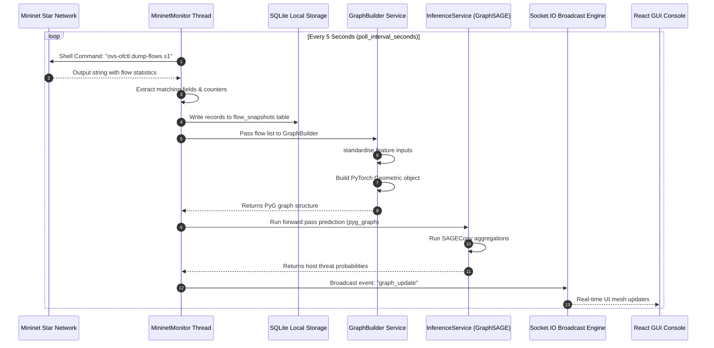
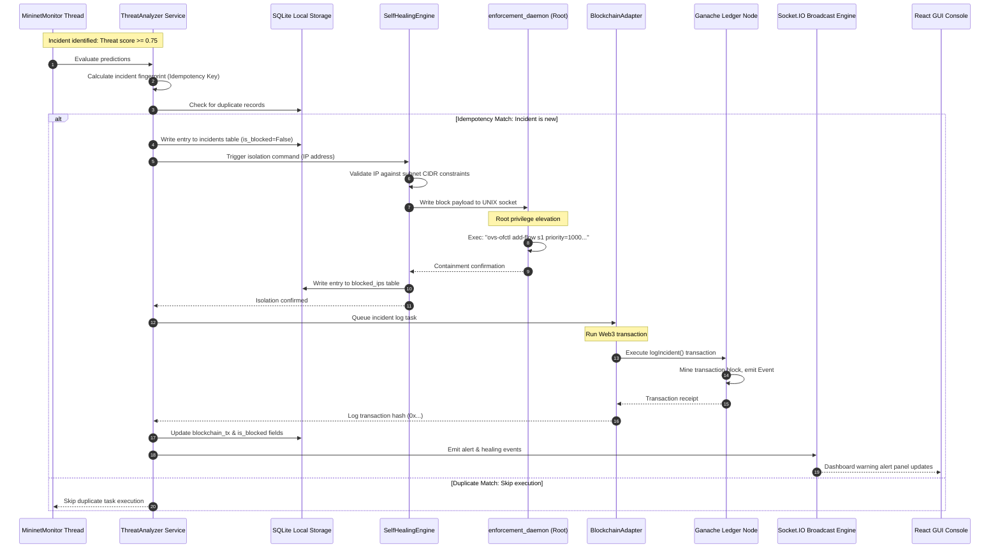

# GraphSentinel Framework: Production-Grade System Architecture & Dataflow Specification

This document serves as the authoritative, engineering-grade technical reference for the GraphSentinel autonomous cyber-defense platform. It defines how data is generated, collected, processed, modeled, logged, and visualized across the entire software-defined network (SDN), machine learning (ML), blockchain, and frontend stacks.

---

## 1. System Overview

### 1.1 Purpose of GraphSentinel
GraphSentinel is an autonomous, closed-loop cyber-defense platform designed to detect, analyze, and mitigate network-layer threats in real time. By merging Software-Defined Networking (SDN) telemetry with Graph Neural Networks (GNNs) and distributed ledger technology, GraphSentinel automates the threat-response lifecycle (Detection, Isolation, Logging, and Visualization) without relying on traditional signature-based security appliances.

```
┌───────────────────────┐      ┌────────────────────────┐      ┌─────────────────────────┐
│  Mininet & OVS Star   │ ───> │   FastAPI Backend      │ ───> │ GraphSAGE Inference     │
│  (Telemetry Source)   │      │   Telemetry Collector  │      │ (Topology-Aware Model)  │
└───────────────────────┘      └────────────────────────┘      └─────────────────────────┘
                                           │                                │
                                           ▼                                ▼
┌───────────────────────┐      ┌────────────────────────┐      ┌─────────────────────────┐
│ React 3D/2D Dashboard │ <─── │ Socket.IO WebSockets   │ <─── │ Autonomous Self-Healing │
│ (Real-time Console)   │      │ & REST API Boundaries  │      │ (OVS Flow Enforcement)  │
└───────────────────────┘      └────────────────────────┘      └─────────────────────────┘
                                           │                                │
                                           ▼                                ▼
                               ┌────────────────────────┐      ┌─────────────────────────┐
                               │ Ganache Blockchain     │ <─── │ SQLite Local Forensics  │
                               │ (Immutable Audit Log)  │      │ (Relational Cold Store) │
                               └────────────────────────┘      └─────────────────────────┘
```

### 1.2 Core Design Philosophy
The system operates on the principle of **Autonomous Closed-Loop Security**:
1. **Continuous Telemetry Polling**: Passive gathering of switch flow-tables.
2. **Context-Aware Inference**: Representing network flows as graph topologies to catch structural and behavioral anomalies using neighborhood aggregation rather than static packet filters.
3. **Deterministic Enforcement**: Programmatically pushing drop rules directly into the open-flow datapath.
4. **Non-Repudiation**: Archiving logs into an immutable blockchain ledger to prevent malicious logs alteration by an attacker who has compromised local servers.

### 1.3 Architectural Components & Choice Rationale

#### Graph Neural Networks (GraphSAGE)
* **Inductive Capabilities**: Traditional GCNs (Graph Convolutional Networks) require a fixed graph structure during training and cannot generalize to unseen nodes without retraining. GraphSAGE (Sample and Aggregate) learns aggregator functions that generalize to new, dynamically added IP addresses (hosts) in a live-monitored network.
* **Structural Representation**: Volumetric attacks (such as DDoS) and lateral movement (such as Port Scanning) are fundamentally topological. Representing flows as edges and hosts as nodes allows GraphSAGE to utilize neighborhood information (e.g., in-degree, out-degree, port distribution patterns) to make predictions.

#### Software-Defined Networking (SDN) & Open vSwitch (OVS)
* **Programmatic Control**: Using standard Linux networking tools or remote controllers, OVS allows instant flow manipulation. GraphSentinel utilizes `ovs-ofctl` to write rules directly to OVS kernel-space flow tables, bypassing user-space overhead and isolating attackers at the link layer within milliseconds.
* **Low Overhead**: By reading flow counters (`packet_count`, `byte_count`) directly from OVS, GraphSentinel avoids full packet capture (PCAP) parsing overhead, which degrades throughput under multi-gigabit workloads.

#### Blockchain Logging (Ganache & Ethereum/Solidity)
* **Log Integrity**: Attackers who successfully breach an enterprise network typically seek to clear system logs (e.g., syslog, auth.log) to hide their footprint. Writing keccak256 fingerprints of security incidents onto a distributed ledger ensures that forensic logs are tamper-proof and cryptographically verifiable.
* **Decentralized Verification**: Provides a non-repudiation mechanism that can be audited by third parties, ensuring security teams can prove that mitigation steps (like host isolation) were executed autonomously in response to specific triggers.

### 1.4 Architectural Assumptions & Constraints
* **Topology Boundary**: The active SDN network is modeled on a star topology over `10.0.0.0/24`. Specifically, hosts range from `10.0.0.1` to `10.0.0.10` connected via a single Open vSwitch `s1`.
* **Telemetry Cadence**: The background monitoring service polls OVS flow tables every 5 seconds (`poll_interval_seconds`).
* **Hardware Requirements**: ML inference runs on CPU by default via PyTorch to eliminate GPU driver dependencies in standard containerized network environments.
* **Security Model**: The backend runs as a non-root user for standard operations, communicating via a local UNIX socket with a root-privileged daemon (`enforcement_daemon.py`) to execute OVS modification commands.

---

## 2. Complete End-to-End Data Flow

### Stage 1: Traffic Generation (Mininet Network Layer)
Mininet emulates a star topology with 10 hosts (`h1` through `h10`) mapped to IP addresses `10.0.0.1` to `10.0.0.10` inside a `/24` subnet. The network relies on Open vSwitch `s1` operating as the dataplane bridge.

```
       [h1]      [h2]      [h3]
        │         │         │
        └─────────┼─────────┘
                  ▼
              [ OVS s1 ] <─── [ Remote / Default Controller c0 ]
                  ▲
        ┌─────────┼─────────┐
        │         │         │
       [h8]      [h9]     [h10]
```

Traffic types generated:
1. **Benign Traffic**: Standard ICMP, TCP handshake, HTTP requests, and UDP datagrams.
2. **DDoS Attack (`ddos_attack.py`)**: Host `h2` floods host `h1` using `ping -f` (ICMP flood), creating an extreme connection rate and out-degree spike from the attacker IP.
3. **Port Scan (`portscan_attack.py`)**: Host `h2` scans target `h1` on ports `22, 23, 53, 80, 443, 445, 3306, 5432, 8080` using bash `/dev/tcp` connection attempts, generating high port entropy.
4. **SSH Brute Force (`ssh_bruteforce_attack.py`)**: Host `h2` rapidly opens socket connections to `10.0.0.1:22` to emulate credential stuffing, leading to high connection density fixed to a single port.
5. **Botnet Burst (`botnet_burst.py`)**: Hosts `h4`, `h6`, and `h8` (bots) periodically connect to `10.0.0.3` (C2 Server) on ports `6667` (IRC) and `8080` (HTTP) in short bursts every 2 seconds, displaying low-volume periodic beacons.

#### Data Flow Diagram (Stage 1)
```
[ Host A (Source) ]
        │
        ▼ (TCP/UDP/ICMP Packet Generation)
[ Open vSwitch s1 Kernel Datapath ]
        │
        ▼ (Flow Counters increment: packets, bytes)
[ OVS Flow Table Match / Action Rules ]
```

#### Outputs
Raw IP packets matched against OVS flows. The OVS switch maintains internal structures including packet counters, byte counters, durations, matching fields (IPs, ports), and active flags.

---

### Stage 2: Flow Collection Layer (FastAPI Telemetry Collector)
The telemetry pipeline operates via pull-based background polling. A worker thread (`MininetMonitor`) runs within the FastAPI application lifecycle, polling OVS at regular intervals.

```
  [ MininetMonitor Background Thread ]
                 │
                 ▼ (Every 5 seconds)
  Executes shell: "sudo ovs-ofctl dump-flows s1"
                 │
                 ▼ (Capture stdout)
  [ flow_parser.parse_ovs_flows() ]
                 │
                 ▼ (Regex parse matching fields & counters)
  Creates FlowRecord models (Pydantic validated)
                 │
                 ▼
  [ SQLite Relational DB ] (Write to flow_snapshots table)
```

#### Collector Logic (`flow_parser.py`)
```python
def parse_ovs_flows(switch="s1"):
    # Runs the shell command "sudo ovs-ofctl dump-flows s1"
    # Parsed values are loaded into FlowRecord models
```
The parser extracts flow telemetry from OVS dump output. If OVS is offline or unreachable, the system falls back to simulated flow generation if `demo_fallback_flows=True` is configured in `settings`.

#### Flow Telemetry Schema (`FlowRecord`)
```json
{
  "src_ip": "10.0.0.2",
  "dst_ip": "10.0.0.1",
  "src_port": 54321,
  "dst_port": 80,
  "protocol": "TCP",
  "packet_count": 15400,
  "byte_count": 10248000,
  "duration_sec": 4.25,
  "tcp_flags": 2,
  "fwd_packets": 15400,
  "bwd_packets": 0,
  "fwd_bytes": 10248000,
  "bwd_bytes": 0,
  "syn_flag_count": 1,
  "flow_bytes_per_s": 2411294.12
}
```

#### Validation & Error Handling
* **Data Limits**: The backend enforces a request limit of 2MB via custom middleware and processes a maximum of 5,000 flow records per cycle (`max_analyze_flows`).
* **Input Validation**: Pydantic verifies that port numbers fall in the `0-65535` range, durations are strictly positive, and packet counters are non-negative.
* **Fallback Strategy**: If OVS commands fail (e.g., due to WSL2 environment limits), a graceful downgrade logs warnings and feeds static telemetry to keep the backend active.

---

### Stage 3: Graph Construction Engine (`graph_builder.py`)
The system constructs a graph where network flows represent nodes, and structural properties represent edges.

```
                  Raw Telemetry (FlowRecord)
                             │
                             ▼
  [ GraphBuilder.build_pyg_graph() Feature Extractor ]
                             │
                             ├─ Nodes: Flow records transformed to node list [N, 7]
                             └─ Edges: Edge indices [2, E] generated by relationships
                                  ├─ Temporal sequence edges (flow[i] -> flow[i+1])
                                  └─ Shared destination port edges (flow_A.dst_port == flow_B.dst_port)
                             │
                             ▼
  [ Z-Score Standardization (Per-Window Normalization) ]
                             │
                             ▼
           PyTorch Geometric Data Object Struct
```

#### Edges Generation Algorithm
To capture both temporal patterns and shared target targets (e.g. port scanning), the engine creates two types of edges:
1. **Temporal Edges**: Links successive flows from the same source IP in chronological order ($Flow_t \rightarrow Flow_{t+1}$).
2. **Port-Share Edges**: Links flows sharing the same `dst_port` to highlight port scan fan-out configurations.

#### PyTorch Geometric Graph Object
```python
# Resulting PyG data representation
Data(
  x=[N, 7],           # Feature tensor (standardized float32)
  edge_index=[2, E],  # Graph connectivity matrix (long)
  flow_records=[...]  # Metadata maps back to raw flows
)
```

---

### Stage 4: Feature Engineering Pipeline
Each node feature vector represents 7 normalized dimensions derived from raw flow telemetry:

| Feature ID | Feature Name | Mathematical Definition / Formula | Expected Range | Rationale & Indicators |
|---|---|---|---|---|
| `0` | **Forward Ratio** | $FwdRatio = \frac{FwdPackets}{FwdPackets + BwdPackets + 1e-6}$ | $[0.0, 1.0]$ | Identifies unidirectional traffic. Values $\ge 0.9$ indicate packet flooding (DDoS/SYN flood). |
| `1` | **Avg Packet Size** | $AvgPktSize = \frac{FwdBytes + BwdBytes}{TotalPackets + 1e-6}$ | $[0, 65535]$ | Measures packet density. Small sizes ($< 100$ bytes) with high rates indicate port scanning. |
| `2` | **Connection Rate** | $ConnRate = \log_{1p}\left(\frac{TotalPackets}{DurationSec}\right)$ | $[0.0, 20.0]$ | Log-scaled transmission rate. Extremely high values point to volumetric network attacks. |
| `3` | **Port Norm** | $PortNorm = \frac{DstPort}{65535.0}$ | $[0.0, 1.0]$ | Standardizes target port indices into $[0.0, 1.0]$ space. |
| `4` | **Byte Asymmetry** | $ByteAsym = \frac{FwdBytes - BwdBytes}{TotalBytes + 1e-6}$ | $[-1.0, 1.0]$ | Captures directional bandwidth asymmetry. High forward asymmetry indicates outbound flooding. |
| `5` | **SYN Ratio** | $SynRatio = \min\left(1.0, \frac{SynFlagCount}{TotalPackets + 1e-6}\right)$ | $[0.0, 1.0]$ | Ratio of connection setup packets. High values ($\approx 1.0$) indicate SYN flooding or port scanning. |
| `6` | **Bytes Rate Norm** | $BytesRateNorm = \frac{\log_{1p}(\min(BytesPerSec, 3e8))}{\log_{1p}(3e8)}$ | $[0.0, 1.0]$ | Normalizes throughput against a 300MB/s (2.4 Gbps) saturation limit. |

---

### Stage 5: GraphSAGE Inference Pipeline
The model architecture uses an inductive neural network to classify node behaviors based on local neighborhood attributes.

```
       Graph Node Features [N, 7]
                 │
                 ▼
     [ SAGEConv Layer 1 ] (7 -> 256, aggregation: "mean")
                 │
                 ▼ [ BatchNorm1d ] -> [ ReLU ] -> [ Dropout (p=0.3) ]
                 │
     [ SAGEConv Layer 2 ] (256 -> 256)
                 │
                 ▼ [ BatchNorm1d ] -> [ ReLU ] -> [ Dropout (p=0.3) ]
                 │
     [ SAGEConv Layer 3 ] (256 -> 2)
                 │
                 ▼
       Linear Projection (Softmax Activation)
                 │
                 ▼
   Target Prediction: Malicious Node Probability [N, 1]
```

#### Tensor Shapes & Execution Path
1. **Input**: Features tensor $\mathbf{X} \in \mathbb{R}^{N \times 7}$ and Edge Index matrix $\mathbf{E} \in \mathbb{R}^{2 \times E}$.
2. **SAGEConv 1**: Aggregates mean features from neighboring nodes:
   $$\mathbf{H}^{(1)} = \text{ReLU}\left(\text{BN}\left(\mathbf{W}_{self}^{(1)}\mathbf{X} + \mathbf{W}_{neigh}^{(1)}\text{mean}_{j \in \mathcal{N}(i)}\mathbf{X}_j\right)\right)$$
   Yields tensor of shape $[N, 256]$.
3. **SAGEConv 2**: Performs second-hop neighborhood aggregation, outputting $[N, 256]$.
4. **SAGEConv 3**: Reduces dimensional channels to $[N, 2]$ raw logits.
5. **Softmax Output**: Translates logits into class probabilities. Column 1 yields malicious probability:
   $$\mathbf{\hat{y}} = \sigma(\mathbf{z}) \in \mathbb{R}^{N \times 1} \quad (\text{range } [0.0, 1.0])$$

#### Execution Environment
Inference runs in a background thread via `asyncio.to_thread` to prevent blocking the async FastAPI event loop. If the model file (`graphsage_weights.pt`) is missing and `require_ml_model=False` is set, the system drops back to rule-based fallback heuristics (`_heuristic_predict`).

---

### Stage 6: Threat Analysis Engine (`threat_analyzer.py`)
After inference, raw host threat probabilities are processed by `ThreatAnalyzer` to determine mitigation responses.

```
               Prediction Score (P_malicious)
                             │
            ┌────────────────┴────────────────┐
            ▼                                 ▼
       Score >= 0.75                     Score < 0.75
     [ Critical / High ]                      │
            │                                 ├─ Score >= 0.50 (Suspicious)
            ▼                                 │    └─ Warning / Audit Log
   1. Infer Attack Type                       ▼
   2. Check Idempotency Key             Score < 0.50 (Normal)
   3. Trigger Self-Healing Isolator
   4. Send Block Rules to OVS
   5. Log Incident to Blockchain
```

#### Attack Type Categorization Heuristics
If a node score triggers mitigation ($\ge 0.75$), the system identifies the attack vector based on flow properties:

```
IF Destination Port == 22 AND Packets > 250:
    RETURN "SSHBrute"
ELSE IF Unique Destination Ports >= 5:
    RETURN "PortScan"
ELSE IF Total Bytes > 1,000,000 AND HTTP Traffic:
    RETURN "DoSHulk"
ELSE IF Packets > 5000 OR Threat Score >= 0.90:
    RETURN "DDoS"
ELSE:
    RETURN "Botnet"
```

#### Idempotency Verification
To prevent redundant block requests and duplicate blockchain transactions, the analyzer builds a unique SHA-256 fingerprint for each incident:
$$\text{IdempotencyKey} = \text{SHA256}(\text{sourceIP} \parallel \text{attackType} \parallel \text{scoreBucket} \parallel \text{timeBucketMinute})$$
If the key exists in the database, the operation is skipped.

---

### Stage 7: Self-Healing Enforcement (`self_healing.py` & `enforcement_agent.py`)
When a mitigation action is approved, the `SelfHealingEngine` initiates a containment workflow.

```
       [ SelfHealingEngine ]
                 │
                 ▼ (IP address checked against CIDR regex)
   [ EnforcementAgent (ovs mode) ]
                 │
                 ▼ (Write JSON to UNIX socket)
       [ /tmp/graphsentinel-enforcer.sock ]
                 │
                 ▼ (Read and execute as root)
     [ enforcement_daemon.py ]
                 │
                 ▼
   Executes: "ovs-ofctl add-flow s1 priority=1000,ip,nw_src=<IP>,actions=drop"
```

#### Command Injection Mitigations
To prevent command injection vulnerability through IP input fields, the daemon enforces strict validation checks:
* The input string must parse as a valid IPv4 address via the `ipaddress` module.
* The IP must belong to the active Mininet network block (`10.0.0.0/24`).
* The address cannot be the subnet network address (`10.0.0.0`) or broadcast address (`10.0.0.255`).

#### Active Containment Rules
The enforcer deploys drop rules to OVS:
```bash
# Drop all incoming packets from the source IP
sudo ovs-ofctl add-flow s1 priority=1000,ip,nw_src=10.0.0.2,actions=drop

# Drop all outgoing packets destined for the source IP
sudo ovs-ofctl add-flow s1 priority=1000,ip,nw_dst=10.0.0.2,actions=drop
```

#### State Synchronization Loop
A background thread (`ReconciliationWorker`) runs every 10 seconds to detect discrepancy states:
1. It queries active drop rules from OVS: `sudo ovs-ofctl dump-flows s1`.
2. It queries the `blocked_ips` table in the SQLite database.
3. If an IP is flagged as blocked in SQLite but lacks OVS drop rules, the daemon reapplies the drop rules.
4. If an OVS drop rule exists for an IP not listed in SQLite, the daemon removes the rule to prevent orphaned blocks.

---

### Stage 8: Blockchain Audit Layer (`IncidentLogger.sol`)
All containment actions are logged on-chain to generate a tamper-proof forensic trail.

```
          [ BlockchainAdapter ] (FastAPI backend)
                    │
                    ▼ (Executes Web3.py call in Thread Pool)
           [ web3_client.py ]
                    │
                    ▼ (Uses account[0] gas provider)
          Sends Tx to Ganache node (port 8545)
                    │
                    ▼ (Tx processed & logged in block)
           [ IncidentLogger.sol ] Smart Contract
                    │
                    ▼ (Contracts state updated)
           Emits Event: IncidentLogged()
```

#### Incident Struct Schema
Logged incidents use a structured layout on-chain:
```solidity
struct Incident {
    uint256 id;             // Primary key identifier
    bytes32 incidentHash;   // keccak256 hash of details
    uint256 timestamp;      // block.timestamp
    string sourceIP;        // Malicious source IP address
    string attackLabel;     // Classified attack type
    uint8 severity;         // Threat severity (1-10)
    bool isBlocked;         // Boolean status indicating isolation
    string forensicsURI;    // Link to SQLite record (local://incident/{id})
}
```

#### Tamper Verification Logic
The smart contract enforces integrity verification by matching logged fields against the computed hash:
```solidity
function verifyIncident(
    uint256 _id,
    string memory _sourceIP,
    string memory _attackLabel,
    uint8 _severity,
    uint256 _timestamp
) public view returns (bool) {
    bytes32 calculatedHash = keccak256(abi.encodePacked(
        _sourceIP, _timestamp, _attackLabel, _severity, _id
    ));
    return calculatedHash == _incidents[_id].incidentHash;
}
```
If an intruder modifies local database records, the values will fail verification against the on-chain hash, signaling a compromise.

---

### Stage 9: WebSocket Event Streaming (`events.py`)
The backend uses Socket.IO to stream security events directly to the frontend interface.

```
                 FastAPI Backend Pipeline
                             │
                             ├─ Analysis finished -> serialize graph state
                             │    └─ Emit: "graph_update"
                             │
                             ├─ Attack detected -> construct alert record
                             │    └─ Emit: "alert"
                             │
                             └─ Isolation triggered -> serialize incident data
                                  └─ Emit: "healing_triggered"
                             │
                             ▼
                    Socket.IO Server Engine
                             │
                             ▼ (Real-time TCP Stream)
                    React Client Listener
```

#### Payload Structures

##### Graph Update Event (`graph_update`)
```json
{
  "type": "graph_update",
  "payload": {
    "nodes": [
      { "id": "10.0.0.2", "label": "h2", "status": "malicious", "threat_score": 0.94, "connections": 8, "bytes_total": 4501200, "attack_type": "DDoS", "is_blocked": false }
    ],
    "links": [
      { "source": "10.0.0.2", "target": "10.0.0.1", "value": 0.94, "attack_type": "DDoS", "packet_count": 8200 }
    ],
    "metadata": { "active_threats": 1, "system_health": 88 }
  }
}
```

##### Alert Event (`alert`)
```json
{
  "type": "alert",
  "payload": {
    "id": 142,
    "timestamp": "2026-06-11T14:40:02Z",
    "source_ip": "10.0.0.2",
    "attack_type": "DDoS",
    "severity": "critical",
    "threat_score": 0.94,
    "description": "DDoS attack detected from 10.0.0.2",
    "is_blocked": true,
    "blockchain_tx": "0x6f9b8c2c..."
  }
}
```

##### Healing Event (`healing_triggered`)
```json
{
  "type": "healing_triggered",
  "payload": {
    "id": 88,
    "timestamp": "2026-06-11T14:40:02Z",
    "ip": "10.0.0.2",
    "action": "ISOLATED",
    "attack_type": "DDoS",
    "trigger_score": 0.94,
    "edges_severed": 8,
    "duration_ms": 320,
    "network_stability_before": 94.2,
    "network_stability_after": 99.8
  }
}
```

---

### Stage 10: Frontend Visualization Layer (React Dashboard)
The React client runs on port `5173`, maintaining state inside a Zustand engine (`useGraphStore`).

```
                Incoming WebSocket Message
                             │
                             ▼
                 [ useWebSocket Handler ]
                             │
            ┌────────────────┼────────────────┐
            ▼                ▼                ▼
     "graph_update"       "alert"     "healing_triggered"
            │                │                │
            ▼                ▼                ▼
     [ updateGraph ]    [ addAlert ]    [ setHealingNode ]
            │                │                │
            └────────────────┼────────────────┘
                             ▼
                    Zustand State Update
                             │
            ┌────────────────┴────────────────┐
            ▼                                 ▼
    [ ForceGraph3D ]                 [ Recharts Component ]
   3D Node Meshes Redraw              Redraw AreaChart
   Wireframe Cages Applied            Threat Timeline Updated
```

#### Rendering Engine Options
* **3D Visualization (`NetworkGraph3D.jsx`)**: Renders node topologies via `react-force-graph-3d` using Three.js meshes.
  * **Normal**: Green sphere ($Radius=4$).
  * **Suspicious**: Amber sphere ($Radius=5$) enclosed by a wireframe torus ring.
  * **Malicious**: Red glowing sphere ($Radius=7$) with a linked point light source.
  * **Blocked**: Blue sphere ($Radius=6$) enclosed within a wireframe containment cage.
* **2D Fallback (`NetworkGraph2D.jsx`)**: Uses Cytoscape.js with a force-directed `cose` layout to display status topologies when WebGL is unavailable.
* **Timeline Analysis (`ThreatTimeline.jsx`)**: AreaChart that maps threat frequencies and active blocks over time.
* **Immutable Logs Console (`BlockchainPanel.jsx`)**: Chronological feed displaying block receipts, verified transaction hashes, and gas footprints.

---

## 3. Data Ownership Matrix

| Data Entity | Origin/Source | Primary Owner | Target Consumers | Cold Storage / Persistence |
|---|---|---|---|---|
| **Raw Packets** | Mininet virtual network interface | Open vSwitch (`s1`) kernel | `flow_parser.py` | None (Transient kernel space) |
| **Telemetry Flow Records** | OVS flow table dump | `MininetMonitor` | `GraphBuilder`, SQLite Database | `flow_snapshots` table (SQLite) |
| **Graph Topologies** | Telemetry records | `GraphBuilder` | `InferenceService`, Client GUI | SQLite (as aggregated snapshot tables) |
| **Standardized Tensors** | Local feature extraction | `GraphBuilder` | `GraphSAGEClassifier` | None (In-memory PyTorch structures) |
| **Threat Scores** | Forward pass predictions | `InferenceService` | `ThreatAnalyzer`, Client GUI | `incidents` table (SQLite) |
| **Security Alerts** | Threat categorization | `ThreatAnalyzer` | Socket.IO clients, Dashboard | `incidents` table (SQLite) |
| **Blocked Node States** | Enforcement engine actions | `SelfHealingEngine` | `ReconciliationWorker`, GUI | `blocked_ips` table (SQLite) |
| **Audit Log Ledger** | Incident signatures | `BlockchainAdapter` | Ganache blockchain nodes | Ganache chain storage (`./ganache-data`) |
| **UI Telemetry States** | WebSocket broadcasts | Zustand (`useGraphStore`) | Render components | Session store / browser memory |

---

## 4. Backend Service Interaction Map

The diagram below maps internal endpoints, database connections, socket channels, and IPC boundaries.

```
       [ Client Browser / UI Dashboard ]
           │                     │
           │ (REST API)          │ (Socket.IO WebSockets)
           ▼                     ▼
┌────────────────────────────────────────────────────────┐
│                   FastAPI Backend                      │
│                                                        │
│   [ API Routers ] <───────> [ WebSocket Server ]       │
│          │                           ▲                 │
│          ▼                           │                 │
│   [ database.py ]                    │ (Broadcasts)    │
│          │                           │                 │
│          ▼                           │                 │
│   [ SQLite Store ]                   │                 │
│          ▲                           │                 │
│          │                           │                 │
│   [ MininetMonitor ]                 │                 │
│          │                           │                 │
│          ▼                           │                 │
│   [ Analysis Pipeline ] ─────────────┘                 │
│    ├── InferenceService (GraphSAGE Model)              │
│    ├── ThreatAnalyzer (Attack Classification)          │
│    ├── SelfHealingEngine (Containment Actions)          │
│    └── BlockchainAdapter (Ledger Logging)              │
└──────────┬───────────────────────────┬─────────────────┘
           │                           │
           │ (UNIX Domain Socket)      │ (Web3 JSON-RPC)
           ▼                           ▼
┌──────────────────────┐   ┌──────────────────────┐
│  enforcement_daemon  │   │  Ganache Blockchain  │
│  (Root OVS Control)  │   │  (IncidentLogger)    │
└──────────────────────┘   └──────────────────────┘
```

---

## 5. Database and Persistence Strategy

GraphSentinel uses a **dual-storage architecture** to maintain a balance between fast analytical reads and tamper-proof forensic auditing.

```
                       Inference Engine
                              │
             ┌────────────────┴────────────────┐
             ▼                                 ▼
   [ SQLite Relational DB ]          [ Ganache Blockchain ]
   - Local, High-Throughput          - Remote, Decentralized
   - Writes raw flow snapshots       - Writes incident hashes
   - Powers timeline AreaCharts      - Forensic non-repudiation
```

### 5.1 SQLite Local Storage
* **WAL Mode**: The SQLite instance is configured with Write-Ahead Logging (`journal_mode=WAL`) to allow concurrent reads during active write operations.
* **Role**: Serves as the primary data source for timeline charts, historical queries, and the active state of isolated hosts.

### 5.2 Ethereum Ledger Storage
* **Role**: Acts as a decentralized forensic store.
* **Hash Anchoring**: The backend calculates the cryptographic fingerprint of each incident and logs it to the smart contract:
  $$\text{IncidentHash} = \text{keccak256}(\text{IP} \parallel \text{Timestamp} \parallel \text{AttackType} \parallel \text{Severity} \parallel \text{IncidentID})$$
  This links local SQLite rows to immutable ledger transactions.

### 5.3 Distributed Production Upgrades (Proposed Architecture)
To scale this architecture for high-volume enterprise networks, the following storage tiers are recommended:

```
Telemetry Source ──> [ Kafka Ingestion ] ──> [ Spark Streaming ]
                                                   │
                ┌──────────────────────────────────┴──────────────────────────────────┐
                ▼                                                                     ▼
     [ ClickHouse Analytics ]                                              [ Event Sourcing (Redis) ]
     - Cold storage for raw packets                                        - Stores state mutations
     - High-capacity compression ratio                                     - Real-time event pub/sub
```

* **Kafka Ingestion Hub**: Replaces pull-based OVS polling with an event-driven queue to handle large-scale telemetry feeds.
* **ClickHouse Analytics Database**: Replaces SQLite to provide high-capacity compression and fast query speeds for raw packet records.
* **Event Sourcing (Redis & PostgreSQL)**: Separates transaction commands from analytical queries (CQRS pattern) and uses Redis cache tables to handle WebSocket broadcasts.

---

## 6. Failure Scenarios

The framework implements failure handling mechanisms to maintain network connectivity and operational logging during subsystem failures.

| Failure | Detection | Operational Impact | Mitigation & Recovery |
|---|---|---|---|
| **Mininet Telemetry Loss** | System detects command timeouts or empty strings from `ovs-ofctl dump-flows`. | Telemetry polling drops out; the dashboard ceases graph updates. | The collector falls back to simulated flow generation (`demo_fallback_flows`) to keep services active. |
| **Feature Extraction Failure** | Extraction functions detect missing fields or `NaN` outputs. | GNN inference receives invalid tensor dimensions, blocking evaluation. | Null values are clamped to `0.0`, standardizing inputs to preserve structural consistency. |
| **Model Weights Missing** | System catches missing `pt` weights files during application initialization. | The backend cannot load the GNN model. | The backend switches to rule-based fallback heuristics (`_heuristic_predict`), flagging an alert status. |
| **Enforcer Socket Disconnection** | The enforcer client detects a missing UNIX socket or catches socket exceptions. | The backend cannot push drop rules to the switch datapath. | The engine flags the node status as `pending_enforcement` and logs details to the local SQLite database. |
| **Reconciliation Sync Lag** | The worker loop detects mismatch states between active OVS rules and database tables. | Stale OVS rules remain active or manual unblock requests are delayed. | The sync loop reconciles differences every 10 seconds, pushing commands to match OVS configurations. |
| **Blockchain Offline** | The Web3 provider catches connection timeouts or RPC socket errors. | Transaction receipts fail to generate, blocking logs write. | The backend drops into mock logging mode, marking transaction hashes as `pending` to avoid blocking the pipeline. |
| **WebSocket Connection Loss** | Client receives `connect_error` or `disconnect` alerts. | The frontend interface ceases real-time rendering. | The client automatically shifts to HTTP polling every 10 seconds while initiating reconnect sequences. |

---

## 7. Performance Analysis

### 7.1 Computational Complexity

#### Graph Construction (`graph_builder.py`)
* **Node Feature Extraction**: Runs in $\mathcal{O}(N)$ where $N$ represents the number of active flows within the tracking window.
* **Edge Index Creation**: Iterates through flows to identify temporal and target port relationships. Computing port-share edges runs in $\mathcal{O}(N^2)$ in the worst-case. Using hash maps to group destination ports reduces this lookup cost to $\mathcal{O}(N)$.

#### GraphSAGE Inference (`graphsage_model.py`)
* **Layer Complexity**: The computational cost for a 3-layer GraphSAGE architecture is:
  $$\mathcal{O}\left(L \cdot \|\mathbf{E}\| \cdot d_{in} \cdot d_{out}\right)$$
  Where $L$ is the layer count ($3$), $\|\mathbf{E}\|$ is the number of edges, and $d$ represents feature channel dimensions ($7 \rightarrow 256 \rightarrow 256 \rightarrow 2$).
* **Inference Overhead**: Since the monitored host pool is bounded ($10$ hosts), inference execution takes less than $15\text{ms}$ on CPU.

#### Blockchain Log Updates
* **Gas Consumption**: Writing to the Ethereum ledger consumes gas relative to storage requirements:
  * Deploying `IncidentLogger.sol`: $\approx 832,154$ gas.
  * Executing `logIncident`: $\approx 85,000 - 120,000$ gas depending on string lengths.
* **Latency Profile**: Transaction confirmations on local Ganache chains take $< 50\text{ms}$. On public testnets, processing time corresponds to block generation constraints ($\approx 12\text{s}$).

#### Frontend Rendering Pipeline
* **Cytoscape 2D**: The layout engine runs force calculations with a time complexity of $\mathcal{O}(V^3)$ where $V$ represents the active node count.
* **Three.js 3D**: WebGL rendering runs at $60\text{fps}$ for up to $1,000$ nodes, bypassing CPU limits via GPU shader acceleration.

---

## 8. Security Analysis

### 8.1 Trust Boundaries & Threat Surfaces
The architecture identifies three critical trust boundaries:
1. **Host-to-Switch Boundary**: Untrusted hosts can generate arbitrary network traffic.
2. **Backend-to-Enforcer Boundary**: The API server runs as a standard user, communicating with a privileged daemon to write network rules.
3. **API-to-Blockchain Boundary**: The backend connects to an RPC interface to commit immutable audit records.

```
 [ Untrusted Host ] ───( Host-to-Switch Boundary )───> [ Open vSwitch Switch ]
                                                              │
                                                     (OVS Telemetry Output)
                                                              │
                                                              ▼
                                                     [ FastAPI Backend ]
                                                              │
                                                (UNIX Socket Command Pipeline)
                                                              │
                                                              ▼
                                                    [ enforcement_daemon ]
```

### 8.2 Attack Scenarios & Mitigations

#### GNN Telemetry Poisoning
* **Attack**: A compromised host generates packet sequences designed to mimic normal behaviors, seeking to artificially inflate standardized features (e.g., standard deviation values).
* **Mitigation**: The system applies z-score standardization to incoming telemetry windows. If anomalous traffic spikes occur, the resulting distribution changes, revealing the outlier hosts.

#### Command Injection Attacks
* **Attack**: An attacker attempts to exploit manual block endpoints (`POST /api/v1/block`) by passing terminal operators (like `; rm -rf /`) in IP parameters.
* **Mitigation**: Input strings are processed by Python's `ipaddress` validation parser. Any input that fails validation is rejected before reaching OVS command wrappers.

#### Blockchain State Manipulation
* **Attack**: An intruder gains root access on the FastAPI server and attempts to overwrite the local SQLite database to erase evidence of malicious activities.
* **Mitigation**: Forensic records are validated against on-chain transaction hashes. If calculated hashes do not match the immutable ledger records, tamper flags trigger alerts on the dashboard.

#### WebSockets Flooding
* **Attack**: An attacker targets the FastAPI WebSocket endpoint with high volumes of mock messages to exhaust system memory.
* **Mitigation**: The API is configured to reject large request payloads ($>2\text{MB}$) and applies a rate limiter using a sliding-window cache to drop excessive requests.

---

## 9. Future Development Guide

For engineers seeking to extend or modify the GraphSentinel framework, this guide outlines the affected files and dependencies for common feature enhancements.

### 9.1 Adding New Attack Types
To implement detection for new threat models (e.g., Exfiltration, ARP Spoofing):
1. **Feature Engineering**: Open `backend/app/services/graph_builder.py` and modify `_feature_row` to add relevant metrics (e.g., ARP request ratios).
2. **Model Training**: Retrain the GraphSAGE network, update `in_channels` in `config.json`, and export the weights to `graphsage_weights.pt`.
3. **Threat Classification**: Update the classification checks in `backend/app/services/threat_analyzer.py` (`infer_attack_type`) to parse the new attack profiles.
4. **UI Assets**: Update `frontend/src/constants/theme.js` to add color mappings and badges for the new classifications.

### 9.2 Upgrading the GNN Model (e.g., GAT, Temporal GNN)
To replace the GraphSAGE architecture with a Graph Attention Network (GAT) or temporal GNN:
1. **Define Architecture**: Modify `backend/app/services/graphsage_model.py` to import and configure GAT layers:
   ```python
   from torch_geometric.nn import GATConv
   ```
2. **Update Inference Service**: Edit `backend/app/services/inference_service.py` to match the tensor output formats of the new model.
3. **Parameter Configuration**: Update the model metrics and tensor dimensions in `ML/GraphSage-model/config.json`.

### 9.3 Integrating Apache Kafka Telemetry Streams
To replace the default OVS polling loop with a Kafka messaging pipeline:
1. **Telemetry Producer**: Deploy a daemon on OVS switches that forwards flow statistics to a designated Kafka topic (e.g., `network-telemetry`).
2. **Backend Telemetry Consumer**: Disable the polling loop in `backend/app/mininet_monitor/monitor.py` and implement an asynchronous consumer:
   ```python
   from aiokafka import AIOKafkaConsumer
   ```
3. **Processing Flow**: Stream incoming event payloads directly to the pipeline parser (`analyze_flows`).

### 9.4 Transitioning to Public Blockchain Networks
To migrate from a local Ganache development environment to a public testnet or layer-2 network (e.g., Sepolia, Polygon):
1. **Configuration Update**: Open `backend/app/config.py` and update the `ganache_url` parameter to point to a public node provider (such as Infura or Alchemy).
2. **Key Management**: Implement secure key signing in `blockchain/web3_bridge/web3_client.py` using private keys loaded from secure environment variables:
   ```python
   signed_tx = w3.eth.account.sign_transaction(tx, private_key)
   ```
3. **Gas Optimization**: Open `IncidentLogger.sol` and optimize state variables to reduce gas costs during transaction execution.

---

## 10. Reinforcement Learning Integration Roadmap

Integrating Reinforcement Learning (RL) allows the platform to move from static threshold-based mitigation to adaptive, risk-weighted responses.

```
       Network Environment Telemetry (Nodes & Edges)
                             │
                             ▼
     [ GraphSAGE ] ──> Feature State Vector Representation (S_t)
                             │
                             ▼
                 [ Deep Q-Network Agent ]
                             │
                             ▼
          Action Selection (A_t) based on Q-Values
            ├── Block Target IP
            ├── Rate-Limit Target IP
            └── No Action / Log Only
                             │
                             ▼
           Containment Rule Applied to Switch Dataplane
                             │
                             ▼
  Feedback Calculation: Loss vs Security Reward (R_t) -> Update Agent
```

### 10.1 Mathematical Formulation of the MDP

#### State Space ($\mathcal{S}$)
The agent evaluates network states using standardized feature vectors generated by GraphSAGE:
$$\mathbf{s}_t = \left[ FwdRatio, AvgPktSize, ConnRate, PortNorm, ByteAsym, SynRatio, BytesRateNorm \right]$$
Along with contextual metadata:
$$\mathbf{m}_t = \left[ \text{SystemHealth}, \text{NodeDegree}, \text{ActiveBlocks} \right]$$

#### Action Space ($\mathcal{A}$)
For any monitored node $i$, the agent selects from a defined set of containment actions:
$$a_t^{(i)} \in \begin{cases} 
      0: & \text{No Action (Allow Traffic)} \\
      1: & \text{Rate-Limit (Throttle Bandwidth via OVS Queue)} \\
      2: & \text{Isolate (Drop all packets via OVS flows)} 
   \end{cases}$$

#### Reward Function ($\mathcal{R}$)
The agent optimizes responses to balance network security against communication availability:
$$\mathcal{R}_t = -w_1 \cdot \text{ThreatExposure} - w_2 \cdot \text{FalseIsolationCost} + w_3 \cdot \text{SystemStability}$$
Where:
* **ThreatExposure**: Penalizes unmitigated malicious traffic:
  $$\text{ThreatExposure} = \sum_{i} P_{\text{malicious}}^{(i)} \cdot \mathbb{I}(a_t^{(i)} == 0)$$
* **FalseIsolationCost**: Penalizes unnecessary isolation of normal traffic:
  $$\text{FalseIsolationCost} = \sum_{i} \left(1 - P_{\text{malicious}}^{(i)}\right) \cdot \mathbb{I}(a_t^{(i)} > 0)$$
* **SystemStability**: A positive reward for maintaining stable throughput across normal nodes.

### 10.2 Proposed Training Loop
```python
# Conceptual RL Training Cycle
for episode in range(total_episodes):
    state = env.reset()
    while not done:
        # Generate feature state representations using GraphSAGE
        state_features = graph_sage.embed(state)
        
        # Select mitigation action using epsilon-greedy policy
        action = rl_agent.select_action(state_features, epsilon)
        
        # Apply containment rules to OVS dataplane
        next_state, reward, done = env.step(action)
        
        # Store transition tuple in experience replay buffer
        replay_buffer.push(state_features, action, reward, next_state)
        
        # Optimize agent network using Bellman updates
        rl_agent.optimize_policy()
        
        state = next_state
```

### 10.3 Safety Constraints & Human Override
* **Critical Node Protection**: Crucial nodes (e.g. gateway IPs, domain controllers) are protected by static policies to prevent accidental isolation:
  $$\text{If } \text{IP} \in \text{Whitelist} \implies a_t^{(i)} \neq 2$$
* **Manual Override**: The security dashboard provides buttons to manually override autonomous decisions (`POST /api/v1/block`), resetting datapath parameters.

---

## 11. Complete Sequence Diagrams

### 11.1 Traffic Polling and Threat Detection
This sequence diagram shows the step-by-step telemetry parsing, model evaluation, and dashboard broadcast loop.



---

### 11.2 Autonomous Containment and Smart Contract Logging
This sequence diagram shows the mitigation, network isolation, and blockchain logging sequence after threat detection.



---

## 12. Developer Quick Reference

### 12.1 Operational Lifecycle Cheat Sheet

```
   [ Application Launch ] 
             │
             ▼
      ( init_db() ) ──> Creates sqlite tables (incidents, blocked_ips, flow_snapshots)
             │
             ▼
    ( load_model() ) ──> Loads SAGEClassifier weights (or drops to heuristics)
             │
             ▼
   ( connect_ledger() ) ──> Verifies web3 provider connection to Ganache
             │
             ▼
 [ Start Worker Loops ]
    ├── MininetMonitor Thread (Polls OVS, runs analysis pipeline every 5s)
    └── ReconciliationWorker Thread (Syncs SQLite states with OVS every 10s)
```

### 12.2 Critical Network Interfaces
* **FastAPI Service Host**: `http://localhost:8000`
* **Real-time WebSocket Interface**: `ws://localhost:8000/socket.io`
* **Local Blockchain Endpoint**: `http://127.0.0.1:8545` (Ganache Chain ID: `1337`)
* **Enforcer UNIX Socket**: `/tmp/graphsentinel-enforcer.sock`

### 12.3 Telemetry API Schema Contracts

#### Telemetry Analysis Endpoint (`POST /api/v1/analyze`)
* **Request Header**: `X-API-Key: <token>` (Validated against backend token settings)
* **Payload**:
  ```json
  {
    "flows": [
      {
        "src_ip": "10.0.0.2",
        "dst_ip": "10.0.0.1",
        "src_port": 52140,
        "dst_port": 22,
        "protocol": "TCP",
        "packet_count": 480,
        "byte_count": 32160,
        "duration_sec": 1.45,
        "tcp_flags": 2
      }
    ]
  }
  ```
* **Response**:
  ```json
  {
    "predictions": {
      "10.0.0.2": {
        "threat_score": 0.942,
        "is_malicious": true,
        "is_suspicious": true
      }
    },
    "incidents_created": 1,
    "healing_triggered": true,
    "ml_mode": "model"
  }
  ```

#### Forensic Query Endpoint (`GET /api/v1/forensics`)
* **Payload**: None
* **Response**:
  ```json
  {
    "sqlite_incidents": [
      {
        "id": 142,
        "source_ip": "10.0.0.2",
        "attack_type": "DDoS",
        "threat_score": 0.942,
        "severity": 9,
        "is_blocked": true,
        "blockchain_tx": "0x6f9b8c2c...",
        "created_at": "2026-06-11T14:40:02Z"
      }
    ],
    "blockchain_incidents": [
      {
        "id": 1,
        "sourceIP": "10.0.0.2",
        "attackLabel": "DDoS",
        "severity": 9,
        "isBlocked": true,
        "txHash": "0x6f9b8c2c...",
        "blockNumber": 42,
        "status": "confirmed"
      }
    ],
    "contract_address": "0xe78A0F7E598Cc8b0Bb87894B0F60dD2a88d6a8Ab",
    "chain_id": 1337
  }
  ```

### 12.4 Troubleshooting Diagnostics

#### Issue: Backend Cannot Connect to Ganache
```
Error output: "Blockchain service unavailable: Cannot connect to http://127.0.0.1:8545"
```
* **Cause**: Ganache is offline or running on a different port.
* **Resolution**: Ensure Ganache is active using the correct mnemonic and port settings:
  ```bash
  npx ganache --host 0.0.0.0 --port 8545 --deterministic --accounts 5 --db ./ganache-data
  ```

#### Issue: Model Weights File Mismatch
```
Error output: "RuntimeError: Error(s) in loading state_dict for SAGEClassifier"
```
* **Cause**: The input feature count configured in `config.json` does not match the dimensions expected by the model weights.
* **Resolution**: Verify that `config.json` is set to `in_channels: 7` and matching architecture parameters.

#### Issue: OVS Isolation Commands Fail
```
Error output: "PermissionDenied: ovs-ofctl must be run as root"
```
* **Cause**: The API server is running without root privileges, or the enforcer daemon is offline.
* **Resolution**: Start the enforcer daemon with root privileges:
  ```bash
  sudo python3 backend/scripts/enforcement_daemon.py
  ```
