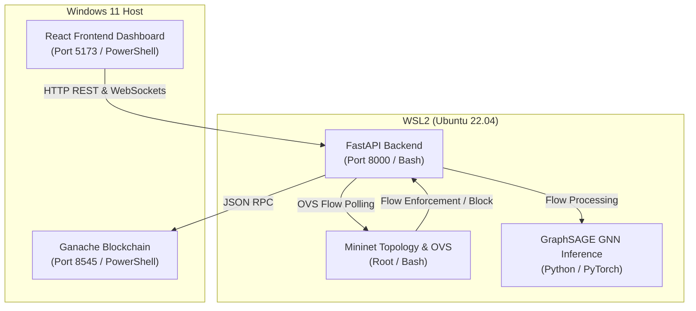

# 🚀 GraphSentinel — Master Startup & Execution Guide

This document is the definitive guide for team members (**Sairaj, Susheep, Skanda, and Sathvik**) to run the entire GraphSentinel pipeline. Follow these instructions exactly to ensure everything integrates and functions correctly.

---

## 🗺️ System Topology & Environment Mapping

Due to OS dependencies (specifically Mininet and Open vSwitch), the system is divided between the **Windows Host** and **WSL2 (Ubuntu Linux)**:



---

## 📋 Prerequisites Checklist

Before launching, ensure you have completed the following setup on your machine:
- [ ] **Node.js**: Version `20.x LTS` installed on the Windows Host.
- [ ] **WSL2 (Ubuntu 22.04)**: Set up with Python `3.10` or `3.12` installed.
- [ ] **Hardhat & Ganache**: Installed in the `blockchain/` folder.
- [ ] **GNN Model Weights**: Sathvik's `graphsage_weights.pt` file must be placed inside `ML/GraphSage-model/` (or matching path configured in `backend/.env`).

---

## 🏁 Step-by-Step Startup Sequence (Run in Order)

Open the specified terminal environment, navigate to the target folder, and execute the commands exactly in this order:

### 1️⃣ Step 1: Start local Ganache Blockchain
*   **Environment:** Windows Host
*   **Terminal:** Windows PowerShell or CMD (Terminal 1)
*   **Directory:** `c:\dev\GraphSentinal\blockchain`
*   **Command:**
    ```powershell
    npx ganache --host 0.0.0.0 --port 8545 --deterministic --accounts 5 --db ./ganache-data
    ```
*   *Wait for:* `Listening on 0.0.0.0:8545` to appear.

---

### 2️⃣ Step 2: Deploy Smart Contract
*   **Environment:** Windows Host
*   **Terminal:** Windows PowerShell or CMD (Terminal 2)
*   **Directory:** `c:\dev\GraphSentinal\blockchain`
*   **Command:**
    ```powershell
    npx hardhat run scripts/deploy.js --network localhost
    ```
*   *Wait for:* `✅ CONTRACT_ADDRESS written to backend/.env` output.
*   *Note:* You only need to run this on the first start, or after clearing Ganache database folders.

---

### 3️⃣ Step 3: Start FastAPI Backend
*   **Environment:** WSL2 (Ubuntu Linux)
*   **Terminal:** WSL2 Bash (Terminal 3)
*   **Directory:** `/mnt/c/dev/GraphSentinal/backend` (or your equivalent WSL mount path)
*   **Command:**
    ```bash
    source .venv/bin/activate
    uvicorn app.main:socket_app --host 0.0.0.0 --port 8000 --reload
    ```
*   *Wait for:* The backend status checklist logs:
    *   `[DB] SQLite initialized [OK]`
    *   `[ML] Mode: model [OK]`
    *   `[Blockchain] Connected: True [OK]`

---

### 4️⃣ Step 4: Start Mininet Network Simulation
*   **Environment:** WSL2 (Ubuntu Linux)
*   **Terminal:** WSL2 Bash (Terminal 4 - **Run as Root/Sudo**)
*   **Directory:** `/mnt/c/dev/GraphSentinal`
*   **Command:**
    ```bash
    sudo python3 mininet/topologies/base_topology.py
    ```
*   *Wait for:* `GraphSentinel network READY` prompt. Keep this shell open! Do not exit.

---

### 5️⃣ Step 5: Start React Frontend
*   **Environment:** Windows Host
*   **Terminal:** Windows PowerShell (Terminal 5)
*   **Directory:** `c:\dev\GraphSentinal\frontend`
*   **Command:**
    ```powershell
    npm run dev
    ```
*   *Access URL:* Open `http://localhost:5173` in your browser.

---

## ⚔️ Triggering Demo Attacks

Once all 5 steps are complete, you can trigger attacks to observe the automated self-healing GNN and blockchain registration in action:

### Option A: The Full WSL2 End-to-End Pipeline (Mininet)
1. Open a new WSL2 Bash Terminal (Terminal 6) and navigate to `/mnt/c/dev/GraphSentinal`.
2. Run the DDoS attack simulation:
   ```bash
   sudo python3 mininet/topologies/attack_scripts/ddos_attack.py
   ```
3. Look at the React dashboard:
   *   Within 5-10s, **10.0.0.2** will turn **RED (Malicious)**.
   *   An alert pops up on the Threat Feed.
   *   The self-healing mechanism blocks the node: **10.0.0.2** turns **BLUE (Blocked)**.
   *   Its links to other nodes are severed.
   *   A transaction hash appears on the Blockchain Panel showing the tamper-proof ledger audit.

### Option B: The Frontend-Only Interactive Simulation
If Mininet or WSL2 is not running, you can demonstrate the exact system behavior locally:
1. Open the React Dashboard (`http://localhost:5173`).
2. Click the **SIMULATE** button on the top-right of the Stats Bar.
3. The dashboard will execute a timed simulation of the exact GNN threat detection, blockchain transaction recording, and self-healing link-severing animations.

---

## 🛠️ Troubleshooting Guide

| Issue | Cause | Solution |
| :--- | :--- | :--- |
| **`UnicodeEncodeError` on startup** | Console encoding conflicts with status icons | Fixed! Checked-in ASCII status labels prevent this error in all standard terminals. |
| **Blockchain connection failed** | Ganache was started after the backend | Always start Ganache (Step 1) **before** uvicorn (Step 3). If failed, restart the backend terminal. |
| **`AF_UNIX` socket exceptions** | Windows does not support UNIX sockets for OVS daemon | Safe! The backend falls back to `simulated` mode automatically without crashing. |
| **CORS / Network errors** | Port 5174 or 3000 blocked | The backend is configured to accept origins on ports `5173`, `5174`, and `3000`. Restart the Vite server to clear port bindings. |
